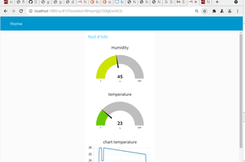
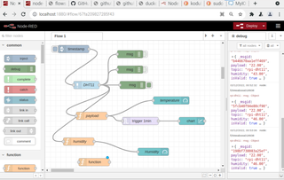
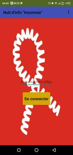
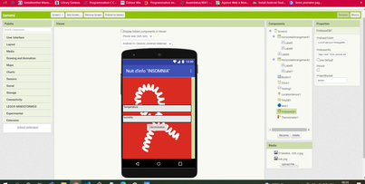

# Project Title
# DIY-et-objets-connect-s_nuit-d-info_insomnia

## Description

Dans ce contexte, le thème de la nuit d'info de cette année est "sexinfo", ce qui correspond à la 34e journée mondiale du sida.  
Développer un dashboard de visualisation de la température et l'humidité et la réalisation d'une application mobile.

*Dashboard:






*Application mobile:





## Getting Started

### matrielles

* Raspberry pi3,DHT11
## logiciels 
* VNC Viewer
* Node red 
* MIT APP Inventor
* Firebase
### Installing with npm
*  Pour installer Firebase , vous pouvez utiliser la commande npm :
```bash
 npm install firebase 
```

* Pour installer Node-RED, vous pouvez utiliser la commande npm fournie avec node.js :
 ```bash
 sudo npm install -g --unsafe-perm node-red
```


### Executing program

## lien
[lien demo](https://drive.google.com/file/d/1R9wmaOYGYse5X32Aa-_QYlkWhe9nNSbj/view?usp=sharing)


